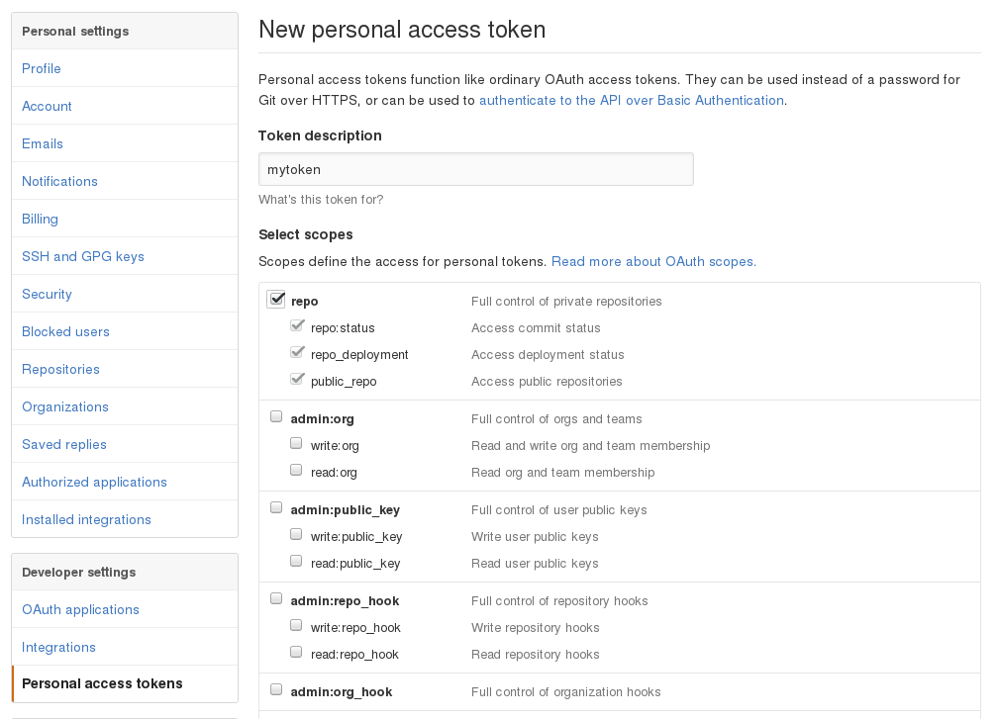
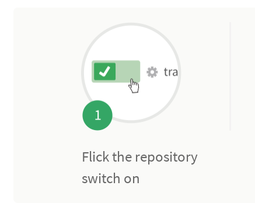
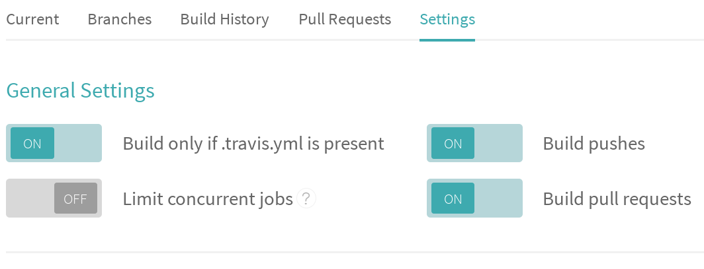
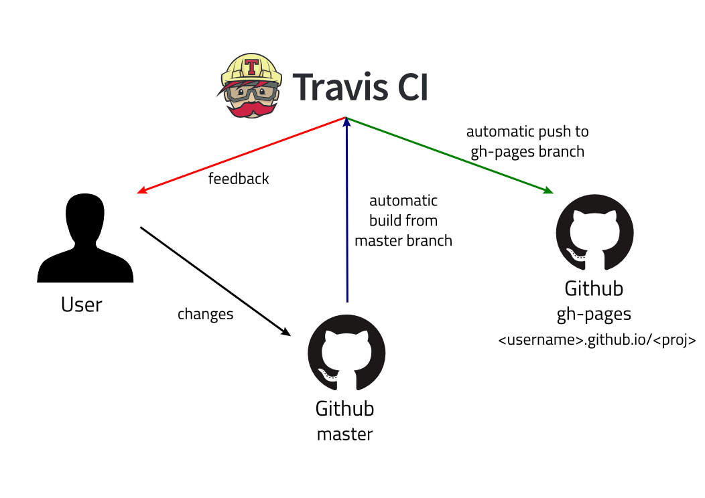

:title: Hosting blog using Github and Travis
:author: BabuSubashChandar
:date: 2016-11-03
:category: Technology
:tags: Pelican, Travis, Github, How-to
:summary: Come on let's host a blog using github.io and automate the build using Travis-CI...

--------------

Story so far
------------

It is already discussed about how one can write their thoughts out
just in a text document in the previous article `here
<https://babuenir.github.io/blog/pelican-based-blogging.html>`__.  The
topics, what is Pelican, then the commandline to kickstart a blogging
site locally are discussed. In this article, hosting the source code
of the blog and the blog using github and automate the build using
Travis-CI will be explained.

Github hosting
--------------

An enormous number of projects hosted in Github. It is a wonderful
platform for anyone to place their code over there. Options are
available to make the project public as well as private. For an
instance, this blog is available as a public Github project. This is
written as a text document and Pelican is used to convert the text
document into a html document applying the theme on it. FYI, this blog
is under MIT license, which means it is open source.

For those who are familiar to git, can jump in to handle checking in
and checking out the source for the blog easily. For the newbies to
git, please refer the cheat sheet to start with git usage `here
<https://services.github.com/kit/downloads/github-git-cheat-sheet.pdf>`__.

The Flow
--------

I'm going to introduce a new term here. Github along with this Travis
is going to do some magic, called "Continuous Integration". The user
has to write their blog content and push it to their corresponding
repository. Once this is done a few settings here and there will make
the Travis CI to pull the content from master branch of the user's
repository and convert them into web articles with a theme mentioned
in the Pelican configuration. Later the output will be pushed to the
gh-pages branch of the same repository. The below illustration show
how things are happening.

|Travis-Github|

Travis CI uses the Github account to signing in. https://travis-ci.org
is the url to access Travis. In the user repository, a file
'.travis.yml' needs to be added. So that a build will be triggered
every time a commit is done on the repository. The sample file is below.

.. code::

  language: python
  python:
    - '2.7'
  script: echo "Hello World!"

Travis provides a stable version of Ubuntu machine instance, in which
the project dependenices are installed and built, the way it is
mentioned in the '.travis.yml' file.

What goes where?
----------------

The user has to create an account and a repository in Github. The link
https://github.com/new will create a repository or clicking the "New
Repository" button in the home page will create it. Proceed to fill up
the different information like repository name, license, readme text
and so on. After this clone the repository to the local machine using
git commands.

.. code:: bash

  ~$ git clone https://github.com/<username>/<project-name>.git

After this, the user has to make some settings. These are kind of a
deal between Travis and Github. All of the user's content will fall
into the 'master' branch in their Github repository. The user has to
create an empty branch named 'gh-pages' in the repository. The user
has to install Travis. This can be done using "gem", since it is a
ruby package. For a Linux based system, the following commands will
install ruby and travis along,

.. code:: bash

  ~$ sudo apt-get install ruby-full
  ~$ sudo gem install travis

After this is done, the user can go ahead to Github settings and
create an access token, from the url
`<https://github.com/settings/tokens/new>`__. The name for the token
as description has to be provided and full control to the repo needs
to be enabled by clicking the first checkbox as below.

Then clicking the generate token button will jump to a page with the
generated token. The token has to be saved somewhere. If it is not
saved, no armagedon ahead; it can be regenerated. But it has to be updated
in every application/deployment, in which the token has been used. Now
the token has to be passed to the Travis cli to encrypt it and add it
to the '.travis.yml' automagically.

.. code:: bash

  ~$ travis login
  Shell completion not installed. Would you like to install it now? |y| y
  We need your GitHub login to identify you.
  This information will not be sent to Travis CI, only to api.github.com.
  The password will not be displayed.

  Try running with --github-token or --auto if you don't want to enter your password anyway.

  Username: <username>
  Password for <username>: ************
  Successfully logged in as <username>
  ~$
  ~$
  ~$ travis encrypt GITHUB_TOKEN=b892442cfd48a31b41eb0f09c72224a1a0edd880
  Detected repository as <username>/<project>, is this correct? |yes|
  Please add the following to your .travis.yml file:

    secure: "pAHsoCLYYsZwMQJyNAae2riKF+K5QSty3cEYja/ESXddW8/yjS1xRXzVlcLPZlisqy1nBe9ZM/jggTbLdNYgtxg3v0hBj88TWD/CMt3WlgfUdEF5qOgs61GAB6vDgXFT/JA2azkoaVdKRPExRw9qGhnkzIJcZAzmMOD46cr37Zuw8ZHcCvVPBxxDkqS1YAePe5xK7i1x5XaC49WyOcEblnQN+eWBn7YjcT4IXNA2kZCJ85rZ/AYmWo8aICp8G/gP3QtzDFs1heORJiFM02q6hX+MVbDVcl1F9NXyoCVU6TiJSj6Qg8yM56XOqQZG6HOgJtJBhZXy8YG5hIE4wCoGx+WTdgqjd2JlhEaiUYF/b1ooKcMwtkkPOMNnQiKtrD5b5XRmqmqg5qAouavjN2BY+lZQdY7Hpn/JCJm3rL1gNhDTsNgaIc59H0sxlMfyLfOZeFsHhiaxoR8Ts4N+pzVqiQChjTO9CLulGm7qDPzJkAEjPPS/SsVqVTllbaY/HFfyEaFIt+jA5UQobxxj4IT3l2G/PF8oZwEbXIpEaJHr8sT7ux7MqlOLlsLrItMjAzNMm4P9Z4kNN4N12aDjellAdbAPZAhqnugZ0aLmHQklj141a4BnSHHuCSocFUHuN/ZDVkHiFXUvTdmzeSOUnhMnvVl4ho+3eSYOsznPiuSqc54="

  Pro Tip: You can add it automatically by running with --add.
  ~$
  ~$
  ~$ travis encrypt GITHUB_TOKEN=b892442cfd48a31b41eb0f09c72224a1a0edd880 --add
  ~$

That's it. An example '.travis.yml' is as follows, it has the secure
environment variable that enables travis to automatically push output
from building the Pelican blog to 'gh-pages' branch.

.. code::

  language: python
  python:
  - '2.7'
  before_install:
  - sudo apt-get update -qq
  install:
  - pip install -r requirements.txt
  script:
  - make clean
  - make html
  env:
    global:
    - secure: pAHsoCLYYsZwMQJyNAae2riKF+K5QSty3cEYja/ESXddW8/yjS1xRXzVlcLPZlisqy1nBe9ZM/jggTbLdNYgtxg3v0hBj88TWD/CMt3WlgfUdEF5qOgs61GAB6vDgXFT/JA2azkoaVdKRPExRw9qGhnkzIJcZAzmMOD46cr37Zuw8ZHcCvVPBxxDkqS1YAePe5xK7i1x5XaC49WyOcEblnQN+eWBn7YjcT4IXNA2kZCJ85rZ/AYmWo8aICp8G/gP3QtzDFs1heORJiFM02q6hX+MVbDVcl1F9NXyoCVU6TiJSj6Qg8yM56XOqQZG6HOgJtJBhZXy8YG5hIE4wCoGx+WTdgqjd2JlhEaiUYF/b1ooKcMwtkkPOMNnQiKtrD5b5XRmqmqg5qAouavjN2BY+lZQdY7Hpn/JCJm3rL1gNhDTsNgaIc59H0sxlMfyLfOZeFsHhiaxoR8Ts4N+pzVqiQChjTO9CLulGm7qDPzJkAEjPPS/SsVqVTllbaY/HFfyEaFIt+jA5UQobxxj4IT3l2G/PF8oZwEbXIpEaJHr8sT7ux7MqlOLlsLrItMjAzNMm4P9Z4kNN4N12aDjellAdbAPZAhqnugZ0aLmHQklj141a4BnSHHuCSocFUHuN/ZDVkHiFXUvTdmzeSOUnhMnvVl4ho+3eSYOsznPiuSqc54=
  after_success:
  - bash deploy.sh

The above '.travis.yml' file is explained as,

.. table::
   :class: no-border

   ===================   ============================================================
   language              the language that this project uses, Travis will install it.
   python                since this project uses python, followed by version 2.7.
   before_install        things to be done before installing any packages.
   install               list of packages to be installed.
   script                steps/commands to be used to build this project.
   env                   list of environment variables used by Travis. Here secure.
   after_success         steps/scripts to be run after build passes.
   ===================   ============================================================

Note that there is a line at 'after_success' step. The script is as
follows used to push the built output from the Travis work area to
Github.

.. code:: bash

  #!/bin/bash

  set -o errexit -o nounset

  if [ "$TRAVIS_BRANCH" != "master" ]
  then
    echo "This commit was made against the $TRAVIS_BRANCH and not the master! No deploy!"
    exit 0
  fi

  rev=$(git rev-parse --short HEAD)

  cd output

  git init
  git config --global user.name "<username>"
  git config --global user.email "<username@example.com>"

  git remote add upstream "https://$GH_TOKEN@github.com/<username>/<project-name>.git"
  git fetch upstream
  git reset upstream/gh-pages

  touch .

  git add -A .
  git commit -m "rebuild pages at ${rev}"
  git push -q upstream HEAD:gh-pages

Okay! Now the user has to login Travis site and configure the build
settings over there. In the link,
https://travis-ci.org/profile/username select the project to be built,
a toggle button as below,

Then enable the project build settings as follows,

Happy Hosting!
--------------

This is the end of the story. With all these settings in place, a blog
or any project can be deployed as wished using the duo, Github and
Travis. This blog is available in Github, so that anyone who wants to
have a reference setup can take a look at that to start with.

Cheers.

---------------

