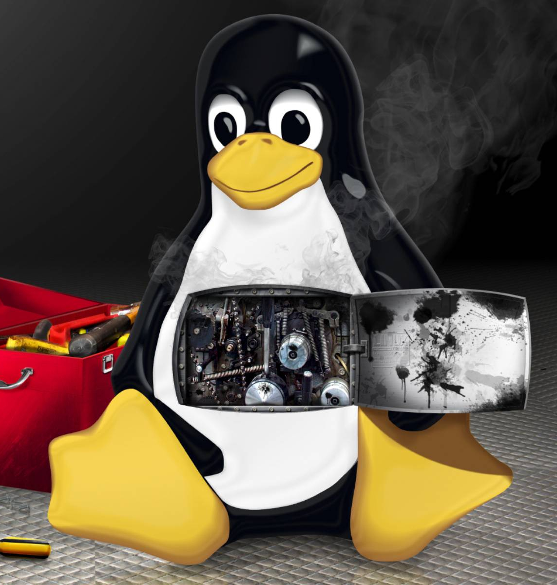

:title: Tools in Linux
:author: BabuSubashChandar
:date: 2016-09-28
:category: Technology
:tags: Linux, Debugging, Tools
:image: static/images/linux-format.jpg
:summary: Imagine a situation with no tools available to check a system’s performance, when it comes to an Embedded system engineer...

--------------

Overview
========

|Tux|

Imagine a situation with no tools available to check a system’s
performance, when it comes to an Embedded system engineer. Especially,
with operating systems like Linux. There are hell lot of tools now at
our service. But during the ages of initial Linux Kernel developement,
think about how system analysis had been done. This post is to throw
some light over the tools that are available for us to poke the system
at right places and see how it behaves.

--------------

Tools Category
--------------

There are several categories and number of tools under each category.

+----------------------------+-----------------------+
| Categories                 | Tools                 |
+============================+=======================+
| **Debugging**              |   GDB                 |
|                            +-----------------------+
|                            |   strace              |
|                            +-----------------------+
|                            |   pmap                |
|                            +-----------------------+
|                            |   pstack              |
|                            +-----------------------+
|                            |   mtrace              |
+----------------------------+-----------------------+
| **Profiling**              |   OProfile            |
|                            +-----------------------+
|                            |   Perf                |
|                            +-----------------------+
|                            |   gprof               |
|                            +-----------------------+
|                            |   memprof             |
+----------------------------+-----------------------+
| **Tracing**                |   ftrace              |
|                            +-----------------------+
|                            |   Lttng               |
|                            +-----------------------+
|                            |   System map          |
|                            +-----------------------+
|                            |   dtrace              |
+----------------------------+-----------------------+
| **Analyzing**              |                       |
+----------------------------+-----------------------+
| **(i) Resource Analyzing** |   valgrind            |
+----------------------------+-----------------------+
| **(ii) Process Analyzing** |   proc tools          |
|                            +-----------------------+
|                            |   vmstat              |
|                            +-----------------------+
|                            |   procstat            |
+----------------------------+-----------------------+
| **Coverage**               |   gcov                |
+----------------------------+-----------------------+
| **Benchmarking**           |   LMbench             |
|                            +-----------------------+
|                            |   IOzone              |
|                            +-----------------------+
|                            |   memtester           |
|                            +-----------------------+
|                            |   flashbench          |
|                            +-----------------------+
|                            |   fio                 |
+----------------------------+-----------------------+
| **Additional tools**       |   stress-app test     |
|                            +-----------------------+
|                            |   measuretime         |
|                            +-----------------------+
|                            |   grabserial          |
|                            +-----------------------+
|                            |   linux-serial-test   |
+----------------------------+-----------------------+

----------

Debugging
~~~~~~~~~

The tools here are helpful when we are in need of understanding what is
going on while the executing a program that is holding the computer with
itself. The sequence of system calls, memory it consumes and so on can
be traced using the following tools.

+-------------+--------------------------------------+
| Tool        | Description                          |
+=============+======================================+
| **GDB**     | the GNU Project debugger, allows you |
|             | to see what is going on inside an    |
|             | other program while it executes-or   |
|             | what another program was doing at    |
|             | the moment it crashed.               |
+-------------+--------------------------------------+
| **strace**  | runs the specified command until it  |
|             | exits. It intercepts and records the |
|             | system calls which are called by a   |
|             | process and the signals which are    |
|             | received by a process.               |
+-------------+--------------------------------------+
| **pmap**    | reports the memory map of the process|
+-------------+--------------------------------------+
| **pstack**  | attaches to the active processes     |
|             | named by the pids on the commandline,|
|             | and prints out an execution stack    |
|             | trace, including a hint at what the  |
|             | function arguments are.              |
+-------------+--------------------------------------+
| **mtrace**  | memory debugger included in GNU C    |
|             | library. The handlers log all memory |
|             | allocations and frees to a file.     |
+-------------+--------------------------------------+

-------------

Profiling
~~~~~~~~~

+--------------------------------------+-----------------------------------------+
| Tool                                 | Description                             |
+======================================+=========================================+
| **oprofile**                         | OProfile is a system-wide profiler      |
|                                      | for Linux systems, capable of profiling |
|                                      | all running code at low overhead.       |
|                                      | OProfile leverages the hardware         |
|                                      | performance counters of the CPU to      |
|                                      | enable profiling of a wide variety of   |
|                                      | interesting statistics, which can also  |
|                                      | be used for basic time-spent profiling. |
+--------------------------------------+-----------------------------------------+
| **perf**                             | It is capable of statistical profiling  |
|                                      | of entire system (both kernel and user  |
|                                      | code), single CPU or several threads.   |
+--------------------------------------+-----------------------------------------+
| **gprof**                            | a performance analyzing tool in Unix.   |
|                                      | It uses a hybrid variety of             |
|                                      | instrumentaion and sampling. It is an   |
|                                      | extension of the older prof Unix tool.  |
|                                      | Unlike prof, gprof is capable of limited|
|                                      | call graph printing.                    |
+--------------------------------------+-----------------------------------------+
| **memprof**                          | tool for profiling memory usage and     |
|                                      | finding memory leaks.                   |
+--------------------------------------+-----------------------------------------+

-------------------

Tracing
~~~~~~~

+--------------------------------------+----------------------------------------+
| Tool                                 | Description                            |
+======================================+========================================+
| **ftrace**                           | A Linux kernel internal tracer. It     |
|                                      | includes function tracer. ftrace is    |
|                                      | named after it.                        |
+--------------------------------------+----------------------------------------+
| **Lttng**                            | The LTTng project aims at providing    |
|                                      | highly efficient tracing tools for     |
|                                      | Linux. Its tracers help tracking down  |
|                                      | performance issues and debugging       |
|                                      | problems involving multiple concurrent |
|                                      | processes and threads. Tracing across  |
|                                      | multiple systems is also possible.     |
+--------------------------------------+----------------------------------------+
| **System tap**                       | Assists the diagnosis of a performance |
|                                      | or functional problem. Reduces         |
|                                      | the developers process sequences to    |
|                                      | collect performance data.              |
+--------------------------------------+----------------------------------------+
| **dtrace**                           | A comprehensive dynamic tracing        |
|                                      | framework for troubleshooting kernel   |
|                                      | and application problems on production |
|                                      | systems in real time.                  |
+--------------------------------------+----------------------------------------+

------------------

Analyzing
~~~~~~~~~

Resource Analyzing
^^^^^^^^^^^^^^^^^^

+--------------------------------------+--------------------------------------+
| Tool                                 | Description                          |
+======================================+======================================+
| **Valgrind**                         | Instrumentation framework for        |
|                                      | building dynamic analysis tools.     |
+--------------------------------------+--------------------------------------+
| **Helgrind**                         | A Valgrind tool for detecting        |
|                                      | synchronisation errors in C, C++ and |
|                                      | Fortran programs that use the POSIX  |
|                                      | pthreads threading primitives.       |
+--------------------------------------+--------------------------------------+

-----------------

Process Analyzing
^^^^^^^^^^^^^^^^^

+--------------------------------------+--------------------------------------+
| Tool                                 | Description                          |
+======================================+======================================+
| **proc tools**                       | The proc tools are utilities that    |
|                                      | exercise features of /proc           |
+--------------------------------------+--------------------------------------+
| **vmstat**                           | Reports information about processes, |
|                                      | memory, paging, block IO, traps,     |
|                                      | and cpu activity.                    |
+--------------------------------------+--------------------------------------+
| **procstat**                         | Displays detailed information about  |
|                                      | the processes identified by the pid  |
|                                      | arguments or all processes.          |
+--------------------------------------+--------------------------------------+

----------------

Coverage
~~~~~~~~

+--------------------------------------+--------------------------------------+
| Tool                                 | Description                          |
+======================================+======================================+
| **gcov**                             | A test coverage program. Use it in   |
|                                      | concert with GCC to analyze programs |
|                                      | to help create more efficient, faster|
|                                      | running code and to discover untested|
|                                      | parts of the program.                |
+--------------------------------------+--------------------------------------+

----------------

Benchmarking
~~~~~~~~~~~~

+--------------------------------------+--------------------------------------+
| Tool                                 | Description                          |
+======================================+======================================+
| **LMbench**                          | A benchmarking tool for bandwidth,   |
|                                      | latency and processor clock rate etc.|
+--------------------------------------+--------------------------------------+
| **IOzone**                           | A filesystem benchmark tool. The     |
|                                      | benchmark generates and measures a   |
|                                      | variety of file operations. Iozone   |
|                                      | has been ported to many machines and |
|                                      | runs under many operating systems.   |
+--------------------------------------+--------------------------------------+
| **memtester**                        | DDR testing benchmark.               |
+--------------------------------------+--------------------------------------+
| **flashbench**                       | Flash benchmarking.                  |
+--------------------------------------+--------------------------------------+
| **fio**                              | Flash benchmarking.                  |
+--------------------------------------+--------------------------------------+

------------------

Additional tools
~~~~~~~~~~~~~~~~

+--------------------------------------+--------------------------------------+
| Tool                                 | Description                          |
+======================================+======================================+
| **stress-app test**                  | Stressful Application Test (or       |
|                                      | stressapptest, its unix name) tries  |
|                                      | to maximize randomized traffic to    |
|                                      | memory from processor and I/O, with  |
|                                      | the intent of creating a realistic   |
|                                      | high load situation in order to test |
|                                      | the existing hardware devices in a   |
|                                      | computer. It has been used at Google |
|                                      | for some time and now it is available|
|                                      | under the apache 2.0 license.        |
+--------------------------------------+--------------------------------------+
| **measuretime**                      | Timing analysis.                     |
+--------------------------------------+--------------------------------------+
| **grabserial**                       | Boottime analysis, grabs the serial  |
|                                      | console with respect to pattern and  |
|                                      | time.                                |
+--------------------------------------+--------------------------------------+
| **linux-serial-test**                | For serial bandwidth testing.        |
+--------------------------------------+--------------------------------------+
| **smem**                             | Gives numerous reports on memory     |
|                                      | usage in Linux system.               |
+--------------------------------------+--------------------------------------+
| **SYSSTAT**                          | Contains utilities to monitor system |
|                                      | performance and usage activities.    |
+--------------------------------------+--------------------------------------+

----------------

Usage and Risks
---------------

-  These tools provide better grounds for delivering a quality software.
-  Tests the corner cases.
-  Traces the memory leaks, buffer overflow etc.,
-  Produces the performance data in both system level and application
   level.
-  Using these tools need understanding of its benefits, Knowledge of
   when, where and how to use them.
-  These tools require configurations and particular coding style, which
   increases the size of the binary compiled. This means we need to have
   a provision of debug and release flags in the code.
-  The best approach would be to use these tools from the development
   phase itself.

--------------

Proposed methodologies
----------------------

-  To use QEMU, and Eclipse based build and testing platform during
   developement phase itself.

--------------

Known Issues
------------

-  sftp-server is needed for transferring the information between target
   and host for any profiling / debugging tool.
-  oprofile-server in target and oprofile-viewer(eclipse) in host are
   needed for viewing the report in graphical format.

--------------

Solution
--------

-  We should cross compile sftp-server from openssh source and placed it
   in target (/usr/libexec/sftp-server). This location is mandatory
   because eclipse searches for this path.
-  oprofile-server is cross-compiled for target and oprofile-viewer is
   compiled and install in host.

--------------

References
----------

-  `Perf Tutorial <https://perf.wiki.kernel.org/index.php/Tutorial>`__
-  `Perf Userguide - Eclipse Linux Tools
   Project <http://wiki.eclipse.org/Linux_Tools_Project/PERF/User_Guide>`__
-  `OProfile examples <http://oprofile.sourceforge.net/examples>`__
-  `OProfile Userguide - Eclipse Linux Tools
   Project <http://wiki.eclipse.org/Linux_Tools_Project/OProfile/User_Guide>`__
-  `Valgrind Documentation
   Page <http://valgrind.org/docs/manual/index.html>`__
-  `Valgrind Userguide - Eclipse Linux Tools
   Project <http://wiki.eclipse.org/Linux_Tools_Project/Valgrind/User_Guide>`__
-  `Grabserial elinux page <http://elinux.org/Grabserial>`__
-  `Linux-serial-test <https://github.com/cbrake/linux-serial-test>`__
-  `Eclipse Linux Tools
   Project <http://wiki.eclipse.org/Linux_Tools_Project>`__
-  `Linux Stress
   Tests <https://wiki.archlinux.org/index.php/Stress_Test>`__
-  `Linux Performance Test
   Tools <http://kernel-perf.sourceforge.net/about_tests.php>`__
-  `Linux Memory Test
   Tools <http://www.csn.ul.ie/%7Emel/projects/mmtests/>`__
-  `Phoronix Test Suite <http://www.phoronix-test-suite.com/>`__
-  `Memory Analysis
   Tools <http://web.archive.org/web/20110614010958/http://ktown.kde.org/%7Eseli/memory/analysis.html>`__
-  `smem - memory reporting tool <http://www.selenic.com/smem/>`__
-  `SYSSTAT
   Documentation <http://sebastien.godard.pagesperso-orange.fr/documentation.html>`__

--------------

