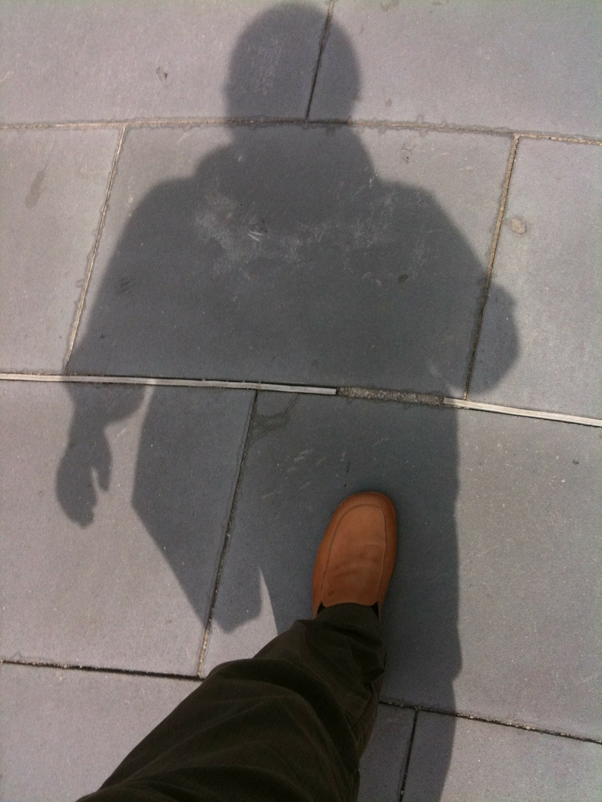

:title: நிழல்
:author: பாபு சுபாஷ் சந்தர்
:slug: nizhal
:date: 2008-06-10
:summary: ஒட்டிப் பிறந்த இரட்டைப் பிறவி...
:category: Literature
:tags: நிழல்

-------------------------

ஒட்டிப் பிறந்த இரட்டைப் பிறவி...

|shadow|

.. line-block::

  கண்ணாடி இல்லாமல்
  உன் உருவம் தெரிந்துவிடும்
  வெளிச்சம் கொஞ்சம்
  இருந்தால் போதும் - நிழல்.

  என்னைப் பிரதிபலிக்கும் நீ
  என்னைப் பொருத்தமட்டில்
  எனக்காக ஓருலகில்
  போட்டியிடும் வேட்பாளன் - நிழல்.

  கைக்கோர்த்திட முடியாது
  இருந்தாலும் உலகில்
  தோழனில்லா மானிடர்க்கு
  இயற்கை தந்த தோழன் - நிழல்.

  இலக்குவன் நீ எனக்கு
  இராமன் நான் உனக்கு
  எந்த வனம் நான் செலினும்
  மறுப்பின்றி தொடர்வாய் - நிழல்.

  என் காலடிச் சுவடுகளில்
  நான் அறியாமல் பின்தொடர்வாய்
  என் காலோடு ஒட்டிப்பிறந்த
  பாசமிகு இரட்டைப்பிறவி நீ - நிழல்.

  -அன்பன் பாபு.

-----------------

