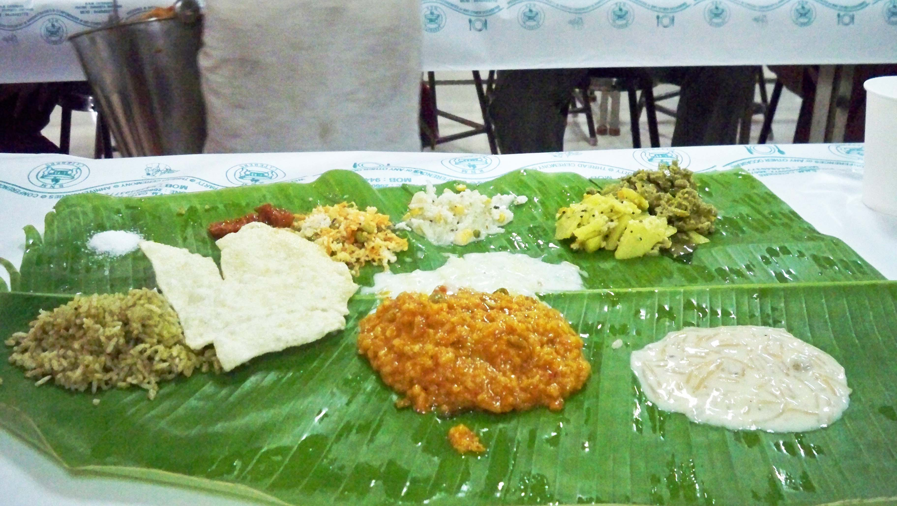

:title: ஓர் அழையா விருந்தாளி
:author: பாபு சுபாஷ் சந்தர்
:slug: or-azhaya-virundhaali
:date: 2011-06-28
:summary: எல்லோரையும் எரிச்சலூட்டும் விருந்தாளி இவர்...
:category: Literature
:tags: விருந்தாளி
:image: static/images/wedding-lunch.jpg

------------------------------

எல்லோரையும் எரிச்சலூட்டும் விருந்தாளி இவர்...

|lunch|

.. _poem:
.. line-block::

  வெற்றிலை தாம்பூலத்தோடு
        சந்தனம் பழம், பூ வைத்து அழைப்பதற்கு ஆளில்லை
  என்னை விரட்டவே பார்ப்பார்கள்
        அத்துமீறல் குற்றமெனினும் கூட்டத்தோடு கூட்டமாய்
  கண்காணிப்பு வளையத்தை ஊடுருவி
        மெல்ல உள்ளே நுழைந்தேன் அத்திருமணத்திலே
  நானோ ஓர் அழையா விருந்தாளி
        வரவேற்கும் பெண்கள் உபசரணையில்
  என்னைக் கவனித்திருக்கவில்லை சர்க்கரையை ருசிபார்த்தேன்
        கழுத்திலே கைபோட்டு விரட்டிடாது
  கவனமாய் பிறர் கண்களிலே பட்டிடாது
        மேடை வரை சென்று விட்டேன்
  மல்லிகை மணம் சுண்டி இழுக்க மணமகனோடு
         தோள் சேர்த்து புகைப்படத்திற்கு  புன்னகைத்தேன்
  இத்துனையும் நடந்திருக்க யாரும் அறியவில்லை
         யாரென்று என்னை கேட்கவில்ல
  நானோ ஓர் அழையா விருந்தாளி
         உண்மையில் வந்த வேலையை மறந்து விட்டேன்
  சட்டென்று உணர்ந்து கொண்டு
         அடுக்களைக்கே நுழைந்து விட்டேன்
  என்னை மறந்து கல்யாண சமையல் சாதம்
         காய்கறிகளும் பிரமாதம் எனப்பாடி விட்டேன்
  யாரும் கண்டு கொள்ளவில்லை
         அடித்து துரத்தவும் வரவில்லை
  வேலையில் நானும் இறங்கி விட்டேன்
          லட்டையும் காரம் என வரிசையாக
  சுவைத்து விட்டு சாம்பார் மீது கைவைத்து
          ஐயோ என்றே அலறிவிட்டேன்
  சூடு எனினும் பொறுத்துக் கொண்டேன்
          யாரும் என்னைக் துரத்தவில்லை
  நானோ ஓர் அழையா விருந்தாளி
           நான் எச்சில் வைத்த மிச்சத்தை பந்தியிலே தின்றார்கள்
  முடியும் வரையில் பார்த்திருந்தேன்
          மொய்ப்பணம் பைசா எழுதவில்லை
  ஏனென்று யாரும் கேட்க வில்லை
           வந்தது வரையில் லாபமென்று
  தின்பது எல்லாம் தின்று விட்டு
           வெற்றிலை பாக்கிலும் கைவைத்தேன்
  அங்குதான் நான் மாட்டிக் கொண்டேன்
           சனியன் இதெல்லாம் வந்திடுது வசவுகள் வந்து மனந்துளைக்க
  ஒன்றிரண்டடிகள் விழுந்த பின்னும்
           தப்பித்தோம் பிழைத்தோம் என்று ஓடி வந்தேன்
  நானோ ஓர் அழையா விருந்தாளி
           கைவரிசை காட்டிய கருங்காளி, வீட்டுப்புறக்கால் 'ஈ' .!!!

  - அன்பன் பாபு.

----------------------

