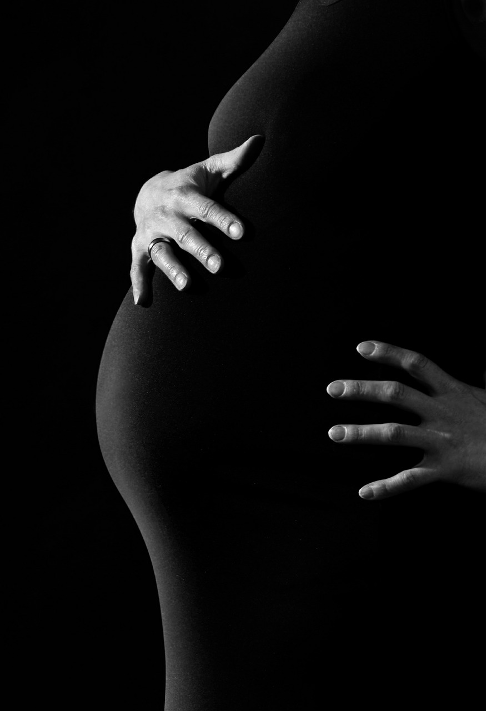

:title: தாயுள்ளம்
:author: பாபு சுபாஷ் சந்தர்
:slug: thaayullam
:date: 2005-09-14
:summary: தாய்மை போற்றுதலுக்குரியது; இதில் எவர்க்கும் மாற்றுக் கருத்தில்லை...
:category: Literature
:tags: தாய்மை

-------------------------

தாய்மை போற்றுதலுக்குரியது; இதில் எவர்க்கும் மாற்றுக் கருத்தில்லை...

|mom|

.. _poem:
.. line-block::

  பத்துத்திங்கள் சுமந்திருந்து
  பத்தியங்கள் தினமிருந்து
  பொறுமையாய் காத்திருந்து
  பலவேதனை ஏற்றிருந்து
  பிஞ்சுதனை ஈன்டிருந்து
  பாலூட்டி புரந்திருந்து
  பிஞ்சுக்கால்கள் உதைத்தாலும்
  நெஞ்சார அணைத்திடுமாம்
  பாசமிகு அன்னையுள்ளம்
  முகம்பார்த்துப் பசிதீர்க்கும்
  ஒவ்வோரசைவையும் ரசித்திருக்கும்
  மழலைதன் வாய்திரந்து
  அமுதமொழி பேசிவிட்டால்
  ஆனந்த கூத்தாடும்
  நோயின் வாயிலகப்பட்டு
  சோறின்றி உறக்கமின்றி
  இரவுமுழுதும் பார்த்திருந்து
  நோய் தீர்க்கும் மருத்துவராய்
  கல்வியிலே நீ சிறிது
  பின்னாலே இருந்திட்டால்
  முதலிடத்தை உன்பின்னே
  இருக்கச்செய்யும் ஆசானாய்
  தனிப்படும் உன்மனதை
  தனியாளாய் இருந்துகொண்டு
  அனைத்துலக இனிமையையும்
  உனக்களிக்கும் தோழியாய்
  இருந்திடும் தாயவளை
  பாராட்டி சீராட்டி
  வளர்த்திட்ட தூயவளை
  பாராட்ட வேண்டாம் நீ,
  புண்படாமல் தாயவளின்
  தூயவுள்ளம் பார்த்துக்கொள்!

  -அன்பன் பாபு.

-----------------

