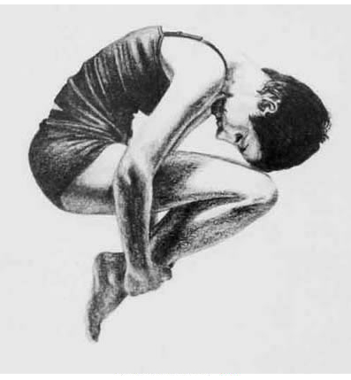

:title: வீழ்ச்சி
:author: பாபு சுபாஷ் சந்தர்
:slug: veezhchi
:date: 2010-12-31
:summary: வீழ்வதை எண்ணியெண்ணி அழுவதை விட வாழும் வழியறிதல் அவசியம்...
:category: Literature
:tags: வீழ்ச்சி
:image: static/images/humiliated.jpg

------------------------------

வீழ்வதை எண்ணியெண்ணி அழுவதை விட வாழும் வழியறிதல் அவசியம்...

|humiliated|

.. line-block::

  ஈர்ப்பு விசை
  உலகில் சட்டென இல்லாமல்
  போனது போல் உணர்கிறேன்
  புவியின் விட்டத்தின் பரப்பை விட்டு
  என்னை ஏதோ ஓர் பறவைபோல
  அல்லாமல் எங்கோ ஒரு கிரகத்தினின்று
  சிதறிய கல்லாய் பறக்கவிட்டு
  ஆளில்லா அரவமில்ல ஓர் பிரபஞ்சப்புள்ளியில்
  தினறடித்ததாய் மனம் குழம்பிக் கிடக்க
  என் உயரம் மரத்துப் போனதாய்
  வெளிச்சம் என்னை புழுவாய் சிரிப்பதாய்
  இருளில் கிடந்தது அழுகிறேன்
  தடாகம் தவறிய மீனாய்
  மண்ணில் உயிருக்கு தவிக்கிறேன்
  நெஞ்சம் சுவாசிக்க மறுத்ததாய்
  உயிரைப் பிழிந்து குருதி வழிவதாய்
  உயிர் கரைவதாய்
  கண் மறைப்பதை
  இருள் சூழ்வதாய்
  என்னை நானே வெறுக்கிறேன்
  தனிமை விரும்பும் மனம்
  தனித்து நிற்றலால் விசும்பும் குரல் கேட்கிறேன்
  உள்ளே என்னுடன் அழுகிறேன்
  குரல்வளை தண்ணீருக்காக தவிக்க
  வார்த்தைகள் எண்ணம் வெளிப்படுத்தாது நிற்க
  சுற்றம் பரிதவிக்க நிற்கிறேன்
  வீழ்வதை புதிதாய் உணர்வதால் அல்லாது
  வீழ்ந்ததை மட்டுமே நினைப்பதால் உளறினேன்...

  -அன்பன் பாபு.

-----------

